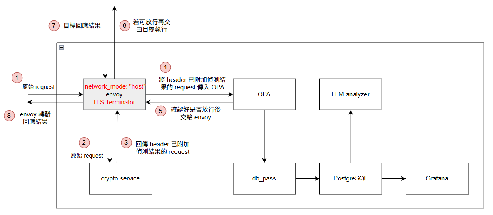

# 針對暴露 Docker API 之抗混淆與自動化防禦機制
## 簡介
這是一個針對暴露於公網的 Docker API 所設計的全防禦系統。本專案整合了 Envoy 代理伺服器、OPA (Open Policy Agent) 原則引擎與 AI 大型語言模型 (LLM)，旨在提供一套對現有 CI/CD 流程低干擾的防護機制。現代雲端服務為了支援自動化部署與遠端管理，往往需要將 Docker API 對外暴露。然而，傳統 WAF (Web Application Firewall) 無法有效解析 Docker API 的 Payload 結構，導致攻擊者能輕易利用 Base64 編碼混淆惡意行為，甚至掛載宿主機根目錄以奪取系統控制權。本系統從流量的邊緣層進行攔截與深度解析，有效填補了自動化便利與資安防禦間的鴻溝。
## 部屬方法
### 1. 設定環境變數
在專案根目錄建立 `.env` 檔案，並設定資料庫使用者名稱跟密碼、Qroq API KEY：
```
POSTGRES_USER=your_database_user_name
POSTGRES_PASSWORD=your_database_user_password
GROQ_API_KEY=your_groq_api_key
```
### 2. 建立憑證資料夾
在專案根目錄建立 `certs/` 資料夾，並放入憑證如：server.crt 以及 server.key

或直接使用以下指令建立資料夾及生成憑證
```
mkdir -p certs
openssl req -x509 -newkey rsa:4096 -keyout certs/server.key -out certs/server.crt -days 365 -nodes -subj "/CN=localhost"
```

### 3. 設定 NAT
此服務預設部屬於兩個 port，分別是

* 8443 port：有開啟 TLS
* 8080 port：無開啟 TLS

因此需將欲受保護的系統設定為會經過其中一個

#### 設定範例
以下幾個指令皆可彼此搭配使用，沒有限制一次只能一條規則生效

1. 僅限制外部(PREROUTING)對 2375 port 發送的 TCP 請求需轉發至此系統的 8443 port (本機自身對自身的請求不會被轉發)
```bash
sudo iptables -t nat -A PREROUTING -p tcp --dport 2375 -j REDIRECT --to-ports 8443
```
2. 僅限制外部(PREROUTING)且由網卡 ens18 進入，對 192.168.3.0/24 此一網段中的任意 ip 的 2375 port 發送的 TCP 請求轉發至此系統的 8443 port (本機自身對自身的請求不會被轉發)
```bash
sudo iptables -t nat -A PREROUTING -i ens18 -d 192.168.3.0/24 -p tcp --dport 2375 -j REDIRECT --to-port 8443
```

### 4. 使用 Docker 部屬與啟動服務
執行以下指令編譯並啟動所有服務
```
sudo docker compose up -d --build
```
## 服務架構

### envoy
負責轉發外部進來的請求
### crypto-service
負責掃描請求並整理成報告
### OPA
依據 crypto-service 整理出來的報告決定放行與否後告知 envoy，並傳給 db_pass
### db_pass
將 OPA 傳入的資訊記錄進 PostgreSQL
### PostgreSQL
儲存資訊
### LLM-analyzer
提供 AI 分析請求、crypto-service 提供的報告的功能
### Grafana
利用 PostgreSQL 內的資訊提供視覺化面板，並提供呼叫 LLM-analyzer 的功能 

**此視覺化面板位於 3000 port**

## 功能與特色

**1. 邊緣層動態防禦與細粒度控制 (Edge-Layer Dynamic Access Control)**
*   **無干擾防護：** 透過 Envoy Proxy 於邊緣層攔截流量，無需修改現有的 CI/CD 流程或後端代碼。
*   **OPA 策略引擎：** 基於 Rego 語言實作細粒度的存取控制，精準阻擋高危險容器配置，例如：
    *   特權模式 (`Privileged: true`)
    *   網路隔離突破 (`NetworkMode: host`)
    *   敏感路徑掛載 (如 `/var/run/docker.sock` 或宿主機根目錄 `/`)

**2. 深度 Payload 解析與反混淆 (Deep Payload Analysis & Deobfuscation)**
*   **自動化解碼機制：** 專為防範現代惡意軟體設計，能深入解析 Docker API 的 JSON Payload。
*   **Base64 遞迴還原：** 自動偵測 `Cmd` 或 `Entrypoint` 欄位中的長字串，若符合 Base64 特徵則自動解碼，讓隱藏的惡意腳本（如 `echo... base64 -d | sh`）無所遁形。
*   **可疑指令過濾：** 偵測並阻擋試圖輸出至 Shell（如 `| sh`, `| bash`）或利用 `tr`, `sed` 進行字串清洗的異常行為。

**3. 預先映像檔安全掃描 (Proactive Image Security Scanning)**
*   **Trivy 即時整合：** 在容器實際啟動前，自動提取 Payload 中的 Image 標籤並進行掃描。

**4. 次世代網路指紋識別與威脅追蹤 (Next-Gen Network Fingerprinting & Threat Tracking)**
*   **JA4 / JA3 指紋提取：** 突破傳統僅依靠 IP 追蹤的限制。系統引入最新的 JA4 網路指紋標準（並向下相容 JA3），精準提取用戶端的 TLS 交握特徵。
*   **跨 IP 威脅獵捕 (Threat Hunting)：** 即使攻擊者使用代理伺服器、VPN 或不斷變更來源 IP，系統仍能透過網路指紋識別出相同的攻擊工具（如特定的 Python 腳本或掃描器），為事後鑑識與攻擊行為關聯提供關鍵的數據支撐。

**5. AI 輔助意圖分析與視覺化監控 (AI-Powered Analysis & Visualization)**
*   **LLM 意圖翻譯：** 引入大型語言模型 (LLM) 針對被攔截的 Payload 進行深度語義分析，將複雜的惡意指令轉化為人類可讀的自然語言報告，降低資安人員的分析門檻。
*   **Grafana 即時儀表板：** 提供多維度的數據監控面板，結合 PostgreSQL 資料庫即時展示：
    *   整體 API 流量趨勢與攔截比例。
    *   攻擊手法分佈（如 Base64 混淆佔比、敏感掛載頻率）。